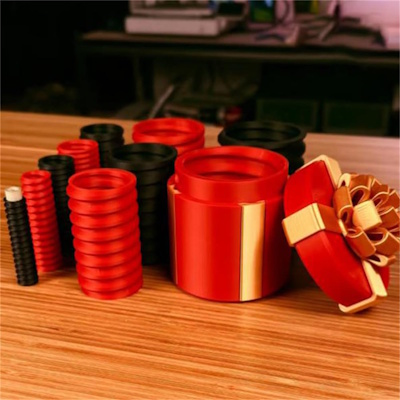
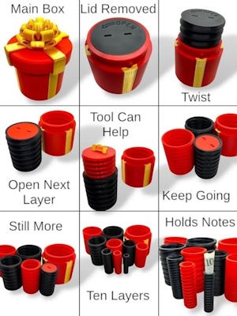
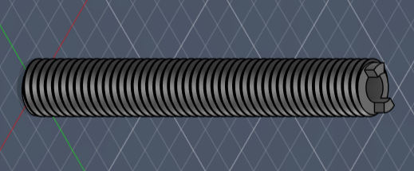
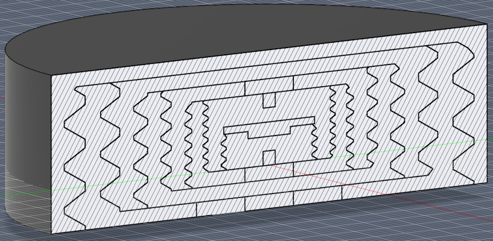
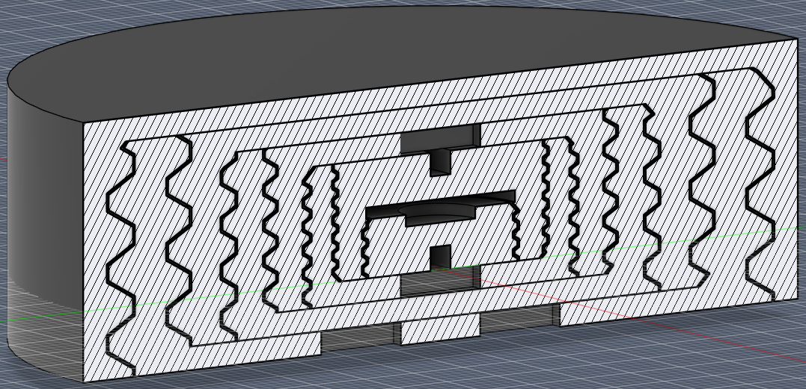
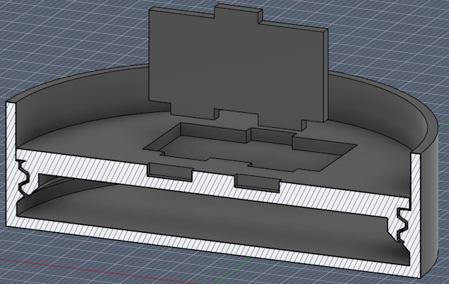
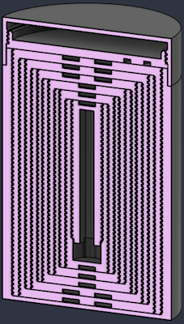
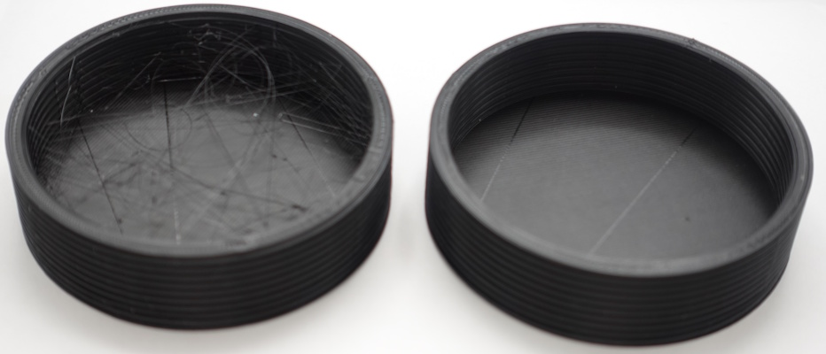
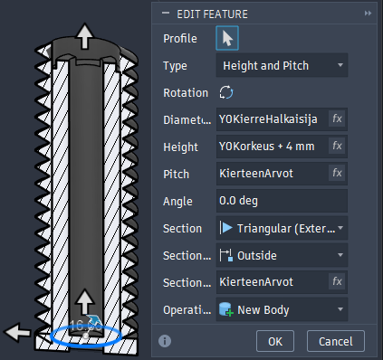
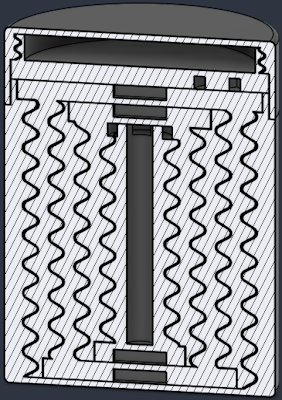

# BusinessAsema FabLab työkokeilu 2026-04-07
Raportointi työkokeilusta

[Canva-posteri](https://canva.link/k62yjphi6xs51g4)

	
Suomeksi

	

		
Projektin tavoite ja rajaus

		 
		Projektin aikana suunnittelen, mallinnan, ja 3D-tulostan lieriöitä, jotka sisä- ja ulkopintojensa kierteillä lukkiutuvat sisäkkäin maatuskan tapaisesti ja muodostavat kokonaisuuden, joka on ärsyttävä koota ja purkaa. Uloimman lieriön koristelen lahjapaketin näköiseksi ja teen sille yhteensopiva kannen, jossa on valekansi oikeaa lahjaa varten.
	

	

		
Projektin tausta ja lähtökohdat

		 
		Teen projektin (kierto)lahjaksi kaverin polttareihin. Vastaavanlaisia tuotteita ja 3D-malleja löytyy valmiina, "nested screw gift box" haulla löytyy monta referenssiä valmistettavasta esineestä. Itsetehdyn lahjan tekemisellä opin mallintamisesta ja 3D-tulostamisesta. Projektin aikana opettelen Autodesk Fusion -ohjelmiston ja tulostamiseen käytettävien tulostimien käyttöä.
		  

 
	

	

		
Käytettävät ohjelmistot, materiaalit, ja teknologiat

		 
		Suunnittelen projektissa valmistettavan esineen Autodesk Fusion -ohjelmistolla ja valmistan sen BusinessAsema FabLab:n Creality Ender-3 V3 SE ja Creality Ender-3 V2 Neo 3D-tulostimilla PLA-filamentista.
	

	

		
Projektin aikataulutus

		 
		
* Taustatyö ja tiedonhankinta: viikot 1-2
* Ideointi: viikot 1-2
* Suunnittelu: viikot 3-4
* Prototyypin toteutus: viikot 3-4
* Testaus ja arviointi: viikot 4-5
* Projektin esittely: viikko 5
	
Aikataulun mahdolliset muutokset voivat johtua tulostimien varaustilanteesta, tulosteiden onnistumisesta, sekä omasta oppimisnopeudesta.
	

	

		
Hissipuhe projektityöstä

		 
		Projekti on Autodesk Fusionilla mallinnettu PLA-muovista 3D-tulostettu lahja, joka koostuu sisäkkäisistä kierteillä kiinnitetyistä lieriöistä. Tein projektin oppimistarkoituksessa, osaamisnäytteeksi, sekä mielijohteesta polttarilahjaksi.
	

	

		
Taustatyö

		Projektissa tulostettavaan esineeseen löytyy vastaavia valmiita tuotteita ja 3D-malleja, “nested screw gift box” hakusanalla etsien löytyy monia referenssejä. Valmiisiin malleihin eroten ajatuksena lisätä kanteen salakansi, jonne voi piilottaa oikean lahjan.
		  
		Lieriöiden kierteiden pitää olla tarpeeksi sileät, jotta esineen kokoaminen ja purkaminen eivät olisi tarpeettoman tuskaisia. Lieriöiden pitää kestää kokoamis- ja purkamisprosessit, sekä istua toisiinsa timmisti turhan liikkeen minimoimiseksi. Ajan ja osaamisen salliessa esineeseen voidaan tehdä esteettisiä ehostuksia.
	

	

		
Toteutus

		

			
Viikko 1 (7. - 9.4.2026)

			 
			Suunnittelin alustavan aikataulun projektille, kirjoitettuna ylempänä. Loin tunnukset Autodeskin alustalle ja katsoin ohjaajien suosittelemaa [Autodesk Fusion -ohjelman opetusvideosarjaa Youtubesta](https://www.youtube.com/playlist?list=PLrZ2zKOtC_-C4rWfapgngoe9o2-ng8ZBr). Mallinsin alustavan 10 mm:n halkaisijan ydinkappaleen kyseisellä ohjelmalla.
		

		

			
Viikko 2 (14. - 16.4.)

			 
			Tulostin ydinkappaleen Original Prusa MK4 Input Shaper -tulostimella 0,4 mm:n tulostuskärjellä; palautteen perusteella päädyn väkäset hyvä muokata isommiksi, jotta ne kestävät rasitusta paremmin. Mallinsin 15 mm:n halkaisijan ydinkappaleen isommilla väkäsillä sekä ensimmäisen välikappaleen testikappaleen, jotka tulostin Creality Ender-3 V3 SE -tulostimella. Testikappaleiden perusteella mallinnan seuraavat iteraatiot väljemmiksi.
		

		

			
Viikko 3 (21. - 23.4.)

			 
			Huomasin, etten voi käyttää valmiita standardeja sekä kappaleiden ulko- että sisäkierteisiin, koska tulostettaessa kappaleista tulisi liian tiukkoja. Käytin kappaleiden ulkopinnoille standardien mukaisia kierteitä ja kaiversin ulompiin kappaleisiin sisempien kappaleiden mukaiset kaiverrukset, jotta saisin kierteet yhteensopiviksi.
			  

  
Siirsin ulompien kappaleiden kierteitä loitommaksi sisäkappaleista, jolla sain kappaleiden välisiä toleransseja kierteille sopivaksi. Siirsin myös ulkopintojen kierteiden huippuja ja laaksoja lähemmäksi toisiaan, näin pyöristäen kierteitä ja helpottaen kappaleiden liittämistä toisiinsa.
  

		

		

			
Viikko 4 (28. - 30.4.)

			 
			Testitulostukset olivat jälleen kerran liian tiukkoja, joten kasvatin kappaleiden välisiä toleransseja ja tein uudet testitulostukset kahdelle ulommaisimmalle kappaleelle ja kahdelle sisimmälle kappaleelle. Uusien testikappaleiden perusteella sopiva toleranssi kierteille on 0,4 mm; tosin sisimpien kappaleiden kierteet tulivat kyseisellä toleranssilla turhan pieniksi, joten kasvatin kierteiden kokoa seuraavaa testitulostusta varten. Mallinsin ja tulostin kannen, valekannen, ja avaimen testikappaleet. Avaimenreiät olivat liian ahtaat, joten kasvatin toleransseja. Mallinsin kuoreen kauluksen kannelle. Tulostin kuoren, valekannen, ja kuuden sisimmän kappaleen uudet testikappaleet.
			  

		

		

			
Viikko 5 (5. - 7.5.)

			 
			Testitulostukset avaimesta, kannesta, ja valekannen testikappaleesta; otin selville avaimen säilytyskolon, valekannen ytimen väkästen kolojen, sekä valekannen ja kannen väliset toleranssit. Testitulostuksien perusteella mallinsin V2 kappaleet: loin kappaleiden välille sidonnaisuuksia, jolloin niiden massamuokkaaminen on helpompaa, ja muutin kaikki kierteet samankokoisiksi esineen avaamisen (ja kokoamisen) rasittavuuden lisäämiseksi. Tein kannen, valekannen, ytimen, ja kahden ydintä lähinnä olevan kappaleen testitulostukset.
		

		

			
Viikko 6 (12. - 13.5.)

			 
			Mallinsin testikappaleen avaimen säilytyskololle; 0,3 mm (seinät) x 0,4 mm (pohja), 0,4 mm x 0,2 mm, 0,4 mm x 0,4 mm, ja 0,4 mm x 0,6 mm toleransseilla. Testitulostuksen perusteella asetin avaimen säilytyskolon toleransseiksi seinille 0,3 mm ja lattialle 0,6 mm. Tulostin ensimmäiset V2 prototyypit.
		

		

			
Viikko 7 (19. - 21.5.)

			 
			Prototyyppien kierteillä oli paljon ylipursotusta, joka teki esineen kokoamisesta lähes mahdotonta. Myös Ydin+10 -osan sisäpinnoilla oli koko korkeudelta häntimistä (engl. *stringing*). Mallinsin lyhyen testikappaleen Ydin+10 -osasta ja tulostin sen samalla tulostimella eri filamentilla; testikappaleessa myös paljon häntimistä. Käytin Prusa Slicerin asetusta "Avoid crossing perimeters" ja tein uudet testitulostukset kuudesta uloimmasta osasta eri tulostimilla ja filamenteilla.
			
		

		

			
Viikko 8 (26. - 28.5.)

			 
			Testitulostukset eivät ruuvautuneet perille asti, vaan jäivät väliltä kiinni; syyksi epäilin tulostuksessa kierteisiin muodostunutta ylipursotusta ja häntimistä. Aloitin V3 osien mallintamisen, joihin tein omat kierteet coil-työkalua käyttäen. Mallinsin ensimmäisen kierteen ydinlierön pinnasta alkavalla halkaisijalla, kolmiopohjalla, 4 mm:n nousulla (engl. *pitch*) ja 4 mm:n koolla (engl. *lead*); vastakkainen kierre 0,4 mm:ä isommalla halkaisijalla ja 4 mm:ä korkeammalla tai matalammalla. Lisäsin kolmannen kierteen alkamaan edellisestä niin, että tasapinnat olivat vastakkain. Lisäsin kierteitä, kunnes uloimman kierteen uloimman reunan halkaisija saavutti 8 cm:ä, jonka sitten liitin kuoren sisäpinnalle. Tein kierteiden kärkiin ja pohjiin 0,8 mm:n pyöristykset.
		

		

			
Viikko 9 (2. - 4.6.)

			 
			Mallinsin ja tulostin V3 testikappaleet. Osien mallinnuksen vaiheet pääpiirteittäin:

1. Lieriön mallintaminen
2. Kierteiden mallintaminen coil-työkalulla lieriön pinnalle
3. Kierteiden siirtäminen korkeussuunnassa
4. Kierteiden leikkaaminen lieriön kokoisiksi
5. Kierteiden huippujen ja laaksojen pyöristys
6. Kierteiden sorvaaminen toisiinsa
7. Sisempien kierteiden liittäminen lieriöön
8. Jalan mallintaminen ja liittäminen lieriöön
		

		

			
Viikko 10 (9. - 11.6.)

			 
			V3 kappaleisiin muodostui yhä ylipursotusta, joten testatiin niiden viipalointia OrcaSlicer-ohjelmalla. Mallinsin V4 kappaleet isommilla kierteillä V3 verrattuna siltä varalta, että viipalointi eri ohjelmalla ei auta. Tein testitulostukset V4 kappaleille.
		

		

			
Viikko 11 (16. - 18.6.)

			 
			Työstin testitulostuksia poistamalla ylipursotusta kierteiden pinnoilta viilalla ja tulostin [valmiin mallin](https://www.printables.com/model/1517265-annoying-nested-screw-gift-box/) toleranssitestin eri viipalointiohjelmilla (Prusa Slicer, OrcaSlicer, UltiMaker Cura). Toleranssitestin tulostus onnistui hyvin, vaikka ylipursotusta ilmeni silti. Mallinsin V5 osia, joihin tuli neljät kierteet. Tulostin vain yhden toleranssitestin osista, huomattavasti parempi jälki.
		

		

			
Viikko 12 (23. - 25.6.)

			 
			Osat v5 mallinnus valmiiksi, testiosien mallintaminen ja tulostaminen. Osat v6 ja testiosat v6 mallinnus. V5 osissa huomattiin, että osat kiertyvät paremmin tietyille kierteille.
		

		

			
Viikko 13 (30.6. - 2.7.)

			 
			Testitulostukset neljästä [valmiin mallin](https://www.printables.com/model/1517265-annoying-nested-screw-gift-box) kappaleesta Creality Ender-3 V2 Neo -tulostimella, viipalointi Prusa Slicer -ohjelmistolla. Ylipursotuksen poistoa viilalla v5 testikappaleiden ulkokierteiltä.
   Valmiin mallin kappaleisiin muodostui myös ylipursotusta ja häntimistä sen verran, että kappaleiden poiskiertämiseen piti käyttää voimaa. V5 testikappaleiden kierteiden ulkopintojen ylipursotuksen poistaminen viilalla auttoi (ytimestä laskien) viidenteen kappaleeseen asti, epäilen (saavutettamattomilla) sisäkierteillä olevan myös ylipursotusta.
   Koska kierteistykset toimivat jälkityöstämisen jälkeen tiettyyn halkaisijaan asti, rajataan lopullisen tuotteen loppuhalkaisijaa pienemmäksi. V5.2 mallinnus, posterin aloitus
		

		

			
Viikko 14 (7. - 9.7.)

			 
			V5.2 testikappaleiden mallinnus ja tulostus 0,16 mm:n kerroskorkeudella. Tekninen piirrustus v5.2 ytimestä. V5.2 kappaleiden tulostus 0,16 mm:n kerroskorkeudella “PolyTerra Dual Camouflage Dark Green-Brown” PLA:lla.
		

		

			
Viikko 15 (14. - 16.7.)

			 
			Hyvä lukija, luette paraikaa tämän viikon aikaansaannosta.
		

	

	
In English

	 
	TODO

